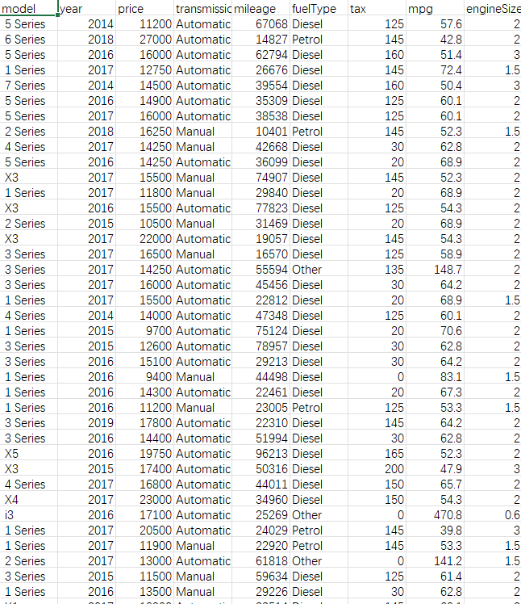

## Body

宝马汽车销售与价格数据集

This dataset contains detailed information about BMW cars, including technical specifications, usage indicators, and prices.
The dataset has been cleaned and formatted to facilitate its use in analysis tools like Python and R.

File Information
File Name: bmw.csv
File Format: CSV
Row Count: Approximately 10,000 records
Column Count: 9
Missing Data: Rare/Cleaned Coding: UTF-8
Last Update Date: 2026
Column Names Description
Model  - Car model (e.g., 3 Series, X5, 5 Series)
Year  - Year of vehicle manufacture
Price  - Car selling price
Transmission - Transmission type (Manual/Automatic/Semi-Automatic)
Miles - Total miles driven (in miles or kilometers)
Fuel Type - Fuel type (Gasoline, Diesel, Hybrid, Electric)
Tax - Annual road tax
Miles per Gallon - Miles per gallon (Fuel efficiency)
Engine Size - Engine displacement

Electronic virtual products are sold without return policy.

## Images

Here is a pay link on Stripe ( https://buy.stripe.com/3cs8yP7sY87d0vu9AB ). Please contact me lonlonago@foxmail.com after funding $89, and I will send you a complete data files , thank you!

